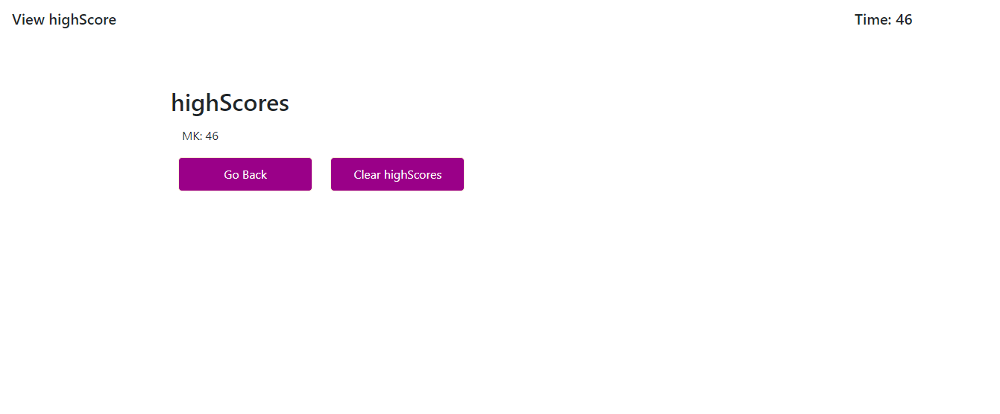
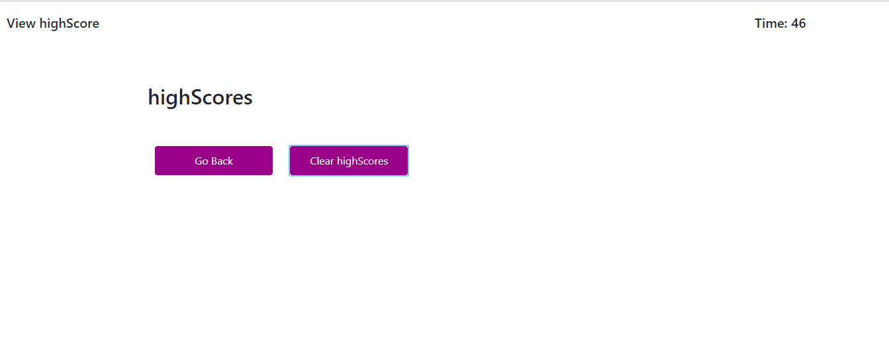

# Web-API-Code-Quiz
 
Title: Code Quiz

Usage/Description:
This assignement  is to allow user to a take a JavaScript code quiz after the click on the Code Quiz button. 

How does this work:
1- When  you lands on the page, they are presented with some instructions about how to take the quiz and what to do avoid penalty.   

2- User will lose 15 seconds worth of points if they miss a question.  
3- If they wait too long the time will keep  going and affect their score
4- They should be sent to All done page if the time reaches zero and they try to go to the next page. 
5- Once all done they will be asked to enter thier initial and then will be sent to final page on which they can see their initial and score display
6- There should also be Clear Highscores and Go gack buttons which will respectivelly clear users initial and score and  refresh the page when  clicked. -    

Tool used to build this site.
1-	Html 
2-	CSS 
3-  Bootstrap
3-	JavaScript 

Credit:
I used the following sites for my  research  during this assignment:
1-google.com
2- https://www.w3schools.com/, stackoverflow.com, bootstrap.com, class recording.    
3-Classmates
4-TA’s and the instructor 

Deploy Link:

Test:
1 -Verify the page’s  look and feel matches the wireframe provided for this assignment- (this maybe slightly different) 
2- Check the other spec such as when you clicks on each button the appropriate actions are performed. 
3-Verify all the pages that were supposed to display are there. 

Image of the Site:

